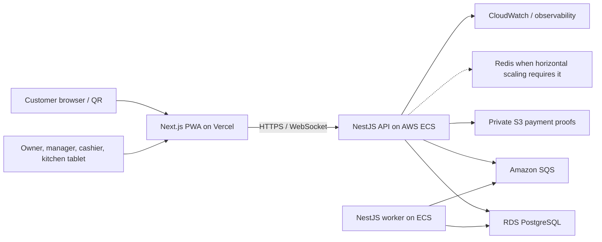

# RMS System Architecture

## 1. Purpose

This document defines the implementation architecture for the All-in-One Restaurant Management and POS System. The MVP is a web-only, installable Progressive Web App (PWA) designed for restaurant tablets, phones, laptops, and customer QR ordering.

The architecture prioritizes:

- Delivery of a reliable MVP within 4-6 weeks.
- Strong tenant and branch isolation.
- Fast POS and Kitchen Display System (KDS) workflows.
- Support for intermittent mobile connectivity without promising full offline order processing.
- A clean path from manual Ethiopian payment verification to future payment-provider integrations.
- Simple operations using Vercel for the frontend and AWS for backend services.

## 2. Confirmed Product Context

- Primary market: Ethiopia.
- Default currency: Ethiopian birr (`ETB`).
- Web only for the MVP.
- Installable PWA for owners, managers, cashiers, and kitchen staff.
- Customers order through table QR codes or a remote pickup page.
- A tenant is a restaurant business and may contain multiple branches.
- Manual transfer is an MVP payment method. The customer sees the restaurant's payment instructions, pays in an external app, and uploads proof. A cashier verifies or rejects the proof before the order is confirmed for preparation.
- Online payment gateways are optional adapters and are not required for the MVP.
- This is a greenfield system with no legacy code or database constraints.

## 3. Technology Stack

| Area | Choice | Reason |
| :--- | :--- | :--- |
| Monorepo | pnpm workspaces + Turborepo | Shared types, validation, UI, and tooling without splitting repositories. |
| Frontend | Next.js, React, TypeScript | Strong routing, server rendering for public menus, PWA support, and excellent Vercel deployment. |
| UI | Tailwind CSS + shadcn/ui primitives | Fast delivery, accessible components, and tablet-friendly responsive layouts. |
| Client data | TanStack Query | Query caching, retries, invalidation, and reconnect behavior. |
| Forms/validation | React Hook Form + Zod | Typed validation shared with API contracts where practical. |
| Backend | NestJS modular monolith | Clear domain modules, guards, background jobs, WebSockets, and future extraction boundaries. |
| API style | REST under `/api/v1` | Easy to implement, debug, cache, document, and consume. |
| API documentation | OpenAPI generated by NestJS | Machine-readable contract and implementation reference. |
| ORM | Prisma | Type-safe PostgreSQL access, migrations, and productive schema development. |
| Primary database | Amazon RDS PostgreSQL | Transactional consistency for orders, payments, inventory, and tenant isolation. |
| Cache and transient state | Redis, optional for initial MVP | Rate limits, short-lived session data, and horizontal WebSocket scaling when needed. |
| Object storage | Amazon S3 | Private storage for payment proof images and future exports. |
| Async processing | Amazon SQS + NestJS worker | Durable notification, report, and image-processing jobs without coupling them to requests. |
| Real-time updates | Socket.IO WebSockets with polling fallback | Timely KDS/POS updates and resilience on unstable networks. |
| Authentication | Application-managed accounts, Argon2id, short-lived access JWT, rotating refresh sessions | Supports staff accounts and tenant-aware authorization without vendor lock-in. |
| Testing | Vitest/Jest, Supertest, Playwright | Unit, API integration, and end-to-end coverage. |
| Observability | OpenTelemetry-compatible logs/traces + AWS CloudWatch + Sentry-ready hooks | Request correlation and production diagnostics. |
| Frontend hosting | Vercel | Native Next.js delivery, previews, and CDN. |
| Backend hosting | AWS ECS Fargate behind an Application Load Balancer | Predictable long-lived API and WebSocket support with straightforward container deployment. |
| Infrastructure | AWS CDK in TypeScript | Repeatable AWS environments using the same primary language. |
| CI/CD | GitHub Actions | Automated checks, migrations, and deployments. |

## 4. Repository Layout

```text
rms/
|-- apps/
|   |-- web/                 # Next.js PWA: public ordering and staff interfaces
|   |-- api/                 # NestJS HTTP and WebSocket API
|   `-- worker/              # NestJS SQS background worker
|-- packages/
|   |-- contracts/           # Shared API DTO schemas, enums, and generated types
|   |-- database/            # Prisma schema, client, migrations, and seed data
|   |-- ui/                  # Shared accessible UI components and design tokens
|   |-- config/              # Shared TypeScript, ESLint, and test configuration
|   `-- observability/       # Logging, tracing, and correlation helpers
|-- infrastructure/
|   `-- cdk/                 # AWS CDK stacks and environment configuration
|-- docs/                    # Supporting operational and product documentation
|-- .github/workflows/       # CI and deployment workflows
|-- pnpm-workspace.yaml
|-- turbo.json
`-- package.json
```

The first implementation should retain the architecture documents at the repository root. Runtime code must not be mixed into documentation files.

## 5. System Context



## 6. Application Surfaces

One Next.js application serves multiple route groups while keeping authorization and bundles logically separated.

| Surface | Example route | Audience |
| :--- | :--- | :--- |
| Public ordering | `/order/[branchSlug]` | Remote pickup customers. |
| Table ordering | `/table/[qrToken]` | Dine-in customers. |
| Staff sign-in | `/staff/login` | All staff. |
| POS | `/staff/pos` | Cashiers and managers. |
| KDS | `/staff/kitchen` | Kitchen staff and managers. |
| Branch operations | `/staff/operations` | Owners and managers. |
| Menu and inventory | `/staff/catalog`, `/staff/inventory` | Owners and managers. |
| Analytics | `/staff/reports` | Owners and managers. |
| Tenant administration | `/staff/settings` | Owners and managers. |
| Platform administration | `/platform` | Super Admin only. |

PWA installation is offered for staff routes. Public customer routes remain ordinary responsive web pages and do not require installation.

## 7. Backend Module Boundaries

The API is a modular monolith. Modules communicate through explicit services and domain events, not by importing another module's repositories directly.

| Module | Responsibility |
| :--- | :--- |
| Identity | Staff authentication, refresh sessions, password reset, and account status. |
| Tenancy | Tenant, branch, membership, branch assignment, and feature toggles. |
| Catalog | Categories, menu items, variants, modifiers, pricing, and availability. |
| Tables | Dining areas, tables, QR tokens, and dine-in sessions. |
| Orders | Cart validation, order creation, line snapshots, lifecycle, splitting, and merging. |
| Payments | Cash, manual transfer proof, verification, refunds metadata, and provider adapter contracts. |
| Kitchen | Station routing, tickets, status changes, bump, recall, and preparation timestamps. |
| Inventory | Ingredients/items, batches, portions, recipes, deductions, adjustments, and alerts. |
| Reporting | Revenue, item performance, peak hours, and inventory consumption read models. |
| Media | S3 upload authorization, metadata, access control, and retention. |
| Notifications | In-app events and future SMS/push adapter contracts. |
| Audit | Immutable security and business action records. |
| Platform Admin | Tenant provisioning, suspension, and platform-level feature control. |

Keep the modules in one deployable API during the MVP. Extract a service only after measured scaling or team-ownership pressure justifies the operational cost.

## 8. Multi-Tenancy and Branch Isolation

### 8.1 Ownership hierarchy

```text
Platform
`-- Tenant (restaurant business)
    |-- Tenant memberships
    `-- Branch
        |-- Branch staff assignments
        |-- Menu availability and prices
        |-- Tables and QR codes
        |-- Orders and payments
        |-- Kitchen stations and tickets
        `-- Inventory, batches, and adjustments
```

### 8.2 Isolation rules

- Every tenant-owned row contains `tenant_id`.
- Every branch-owned row contains both `tenant_id` and `branch_id`.
- Tenant and branch IDs come from the authenticated context or resolved public token, never directly from trusted client input.
- Prisma access occurs through request-scoped tenant context and repository helpers that require tenant filters.
- PostgreSQL Row-Level Security is enabled as defense in depth for core tenant tables before production launch.
- Cross-tenant foreign keys are prevented with composite constraints where practical.
- Super Admin actions use a separate platform authorization path and always generate audit records.
- S3 object keys begin with `tenant/{tenantId}/branch/{branchId}/...`; clients never receive public bucket paths.

## 9. Ordering and Payment Architecture

### 9.1 Order acceptance boundary

An order is created as `PENDING_PAYMENT` or `PENDING_CONFIRMATION`. It is not sent to the kitchen until the payment policy for that order is satisfied.

- Cash at cashier: cashier confirms cash receipt, then the order becomes `CONFIRMED`.
- Manual transfer: customer uploads proof; payment becomes `PENDING_VERIFICATION`; cashier approves it; then the order becomes `CONFIRMED`.
- Pay later for dine-in, if enabled: authorized staff confirms the order while payment remains outstanding.
- Future gateway: a verified provider webhook records successful payment and confirms the order idempotently.

The payment verification and order confirmation update must run in one database transaction. An outbox event is written in that same transaction so KDS notification cannot be lost after a successful confirmation.

### 9.2 Money rules

- Store money as integer minor units: `amount_minor BIGINT`.
- Store `currency CHAR(3)` and default it to `ETB`.
- Never use floating-point values for prices, taxes, discounts, or totals.
- Persist immutable price, tax, and item-name snapshots on order lines.
- Calculate totals on the server from current catalog rules; never trust totals submitted by a client.
- Make tax and service-charge rules configurable per tenant or branch. Do not hardcode Ethiopian tax rules without reviewed business requirements.

### 9.3 Payment proof safety

- The client asks the API for a short-lived presigned S3 upload URL.
- Accepted formats: JPEG, PNG, or WebP; maximum 5 MB by default.
- Uploaded objects remain private and are served to authorized cashiers through short-lived signed URLs.
- Store checksum, content type, size, uploader context, and scan status.
- Do not treat an uploaded screenshot as payment confirmation.
- Verification requires an authenticated cashier or manager action, optional note, timestamp, and audit entry.

## 10. Real-Time and Reliability Model

- The API publishes tenant- and branch-scoped events such as `order.confirmed`, `ticket.updated`, and `payment.reviewed`.
- WebSocket rooms are scoped by tenant, branch, and role/station.
- Clients receive an event ID and refetch authoritative state after relevant events.
- TanStack Query retries safe reads and resumes them after reconnect.
- POS and KDS screens poll every 10-15 seconds when WebSockets are disconnected.
- Mutating endpoints accept an `Idempotency-Key` for order creation, payment proof submission, payment verification, and status changes.
- The transactional outbox prevents database commits from losing downstream events.
- SQS consumers are idempotent and use dead-letter queues.

Full offline order creation is explicitly outside MVP scope. The PWA may cache its shell and recent read-only data, but it must display connectivity state and disable unsafe actions when server confirmation is unavailable.

## 11. Security Baseline

- Argon2id password hashing with a configurable work factor.
- Short-lived access tokens and rotating, server-tracked refresh sessions in secure, HTTP-only, same-site cookies.
- CSRF protection for cookie-authenticated mutations.
- Role and branch-scope guards on every protected endpoint.
- Rate limits for login, public menu, QR resolution, uploads, and order submission.
- Generic authentication errors and progressive temporary lockout.
- Strict validation and response serialization; unknown input fields are rejected.
- Secrets are stored in AWS Secrets Manager or Vercel encrypted environment variables.
- TLS is mandatory; database and S3 encryption are enabled.
- Audit records cover login/security events, role changes, configuration changes, payment decisions, order voids, inventory adjustments, and tenant administration.
- Payment proof images are retained according to a documented business policy and can be deleted after the retention period.
- No card data is collected or stored by RMS. Future card integrations must use provider-hosted flows.

## 12. Deployment Topology

### 12.1 Environments

- `local`: Docker Compose for PostgreSQL and optional Redis/SQS emulator.
- `staging`: isolated Vercel project and isolated AWS resources.
- `production`: production Vercel project and production AWS resources.

Never share databases, buckets, queues, credentials, or cookies across staging and production.

### 12.2 AWS resources

- ECS Fargate services for `api` and `worker`.
- Application Load Balancer with HTTPS and WebSocket support.
- RDS PostgreSQL in private subnets with automated backups and point-in-time recovery.
- S3 private bucket with lifecycle rules for payment proofs.
- SQS standard queues and dead-letter queues.
- Secrets Manager for database and application secrets.
- CloudWatch logs, metrics, and alarms.
- ElastiCache Redis only when required for multi-instance Socket.IO, distributed rate limiting, or cache pressure.

### 12.3 Release flow

1. Pull request runs linting, type checks, unit tests, integration tests, migration checks, and a production build.
2. Vercel creates a frontend preview.
3. Merge to the main branch deploys staging automatically.
4. Production deployment requires approval.
5. Database migrations run as a one-off ECS task before the new API service receives traffic.
6. Migrations must be backward compatible during rolling deployment.

## 13. Observability and Operations

- Assign a correlation ID to every HTTP request, WebSocket connection, and background job.
- Emit structured JSON logs without passwords, tokens, proof-image URLs, or unnecessary personal data.
- Track latency, error rate, order-confirmation failures, payment review time, KDS delivery lag, queue depth, and database saturation.
- Alarm on elevated API errors, failed migrations, RDS storage/connection pressure, SQS dead letters, and unhealthy ECS tasks.
- Provide `/health/live` and `/health/ready` endpoints.
- Record business timestamps in UTC and render them in the branch's configured timezone, defaulting to `Africa/Addis_Ababa`.

## 14. MVP Boundaries

Included:

- Multi-tenant and multi-branch administration.
- Staff roles and branch assignments.
- Menu, modifiers, branch pricing, and availability.
- Table QR and pickup ordering.
- POS order creation and editing before confirmation.
- Manual transfer proof and cashier approval.
- Cash recording.
- KDS queue and status pipeline.
- Batch/portion inventory deductions and low-stock alerts.
- Basic revenue, best-seller, peak-hour, and consumption reports.
- Audit trail and installable staff PWA.

Deferred unless delivery capacity remains:

- Full offline POS conflict resolution.
- Native mobile apps.
- Direct card or mobile-money gateway integration.
- Fiscal printer, cash drawer, or receipt printer integrations.
- Customer accounts and loyalty programs.
- Advanced accounting, payroll, procurement, and supplier management.
- Cross-branch stock transfer workflow.
- Reservations, delivery dispatch, and marketplace integrations.

## 15. Architecture Acceptance Criteria

The implementation conforms to this architecture when:

- Tenant A cannot read or mutate Tenant B data through any API path.
- Branch-scoped users cannot access an unassigned branch.
- An order cannot reach KDS before its configured confirmation rule succeeds.
- Manual transfer approval is transactional, idempotent, and audited.
- KDS recovers current state after a WebSocket disconnect.
- Monetary calculations are integer-based and reproducible from stored snapshots.
- Payment proofs are private and available only through authorized, expiring access.
- The staff interface is usable at common tablet widths and installable as a PWA.
- Staging and production are independently deployable and observable.

